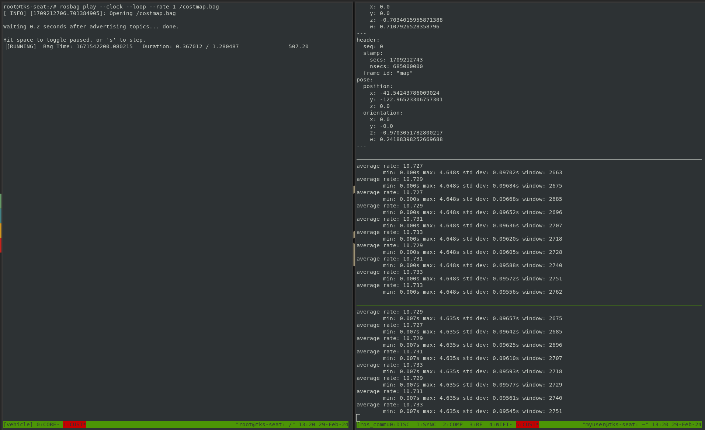
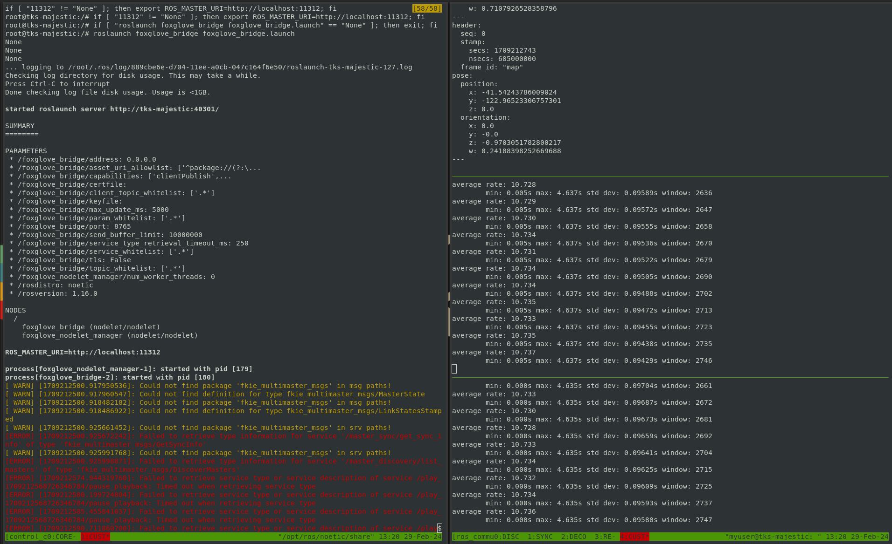
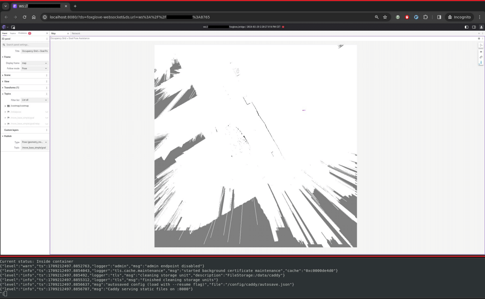

# ROS Communication DevContainer

The ROS Communication DevContainer is a Docker-based solution designed to streamline the synchronization of ROS topics across Linux machines. It's crafted to support scalable communications, facilitating easier remote operations for autonomous vehicles. This project aligns with the publication "Scalable Remote Operation for Autonomous Vehicles: Integration of Cooperative Perception and Open Source Communication."

<details>
<summary>Key Features</summary>

- **Minimal Dependencies**: Only Docker is needed to get started, simplifying the setup process.
- **Isolation**: Operates in a separate Docker container, ensuring minimal impact on existing ROS setups.
- **Centralized Configuration Management**: All configurations are stored and managed in this repository, allowing for easy synchronization across machines via Git.

</details>

## Getting Started

### Forking the Repository

To tailor the ROS Communication DevContainer to your specific needs, we recommend forking this repository. This allows you to make system-specific adjustments and keep your changes organized without affecting the original template.

### Basic Setup for Connected Machines

To prepare your machines for communication, follow these steps on each device:

<details>
<summary>Network Setup</summary>

- Ensure all machines are connected to the same network. This could be an internet connection with VPN, or a local WLAN network.

</details>

<details>
<summary>Machine Preparation</summary>

- **Install Docker**: Required for running the communication module.
- **Visual Studio Code (Optional)**: For enhanced functionality, install Visual Studio Code and the "Dev Container" extension.

</details>

<details>
<summary>Configuration Adjustments</summary>

Adjustments in `config/docker_run_args.json.template` are necessary to fine-tune the communication module for your setup. These configurations are disabled by default for security reasons. Evaluate your security requirements before enabling:
- **Network and Additional Containers**: 
  - Uncomment the necessary lines to enable network capabilities and allow the module to start additional containers as needed.
  - `sudo usermod -aG docker $USER`

- **GUI Support**: For GUI capabilities, such as launching gnome-terminals from within the Docker container, follow these steps:
  1. Temporarily allow X11 forwarding with `xhost +local:docker`. Revert with `xhost -local:` to maintain security.
  2. Uncomment the GUI option in the configuration template.

Sync these settings across machines via Git for consistency.

</details>

<details>
<summary>Repository Initialization</summary>

- Use `re_init/re_init.sh` to initialize or reinitialize machines whenever the repository moves or configurations change.

</details>

## Demonstration and Usage

### Starting Points: Demo Compositions
To start, the demo compositions for `machine_a` and `machine_b` showcase the basic functionality of the ROS Communication DevContainer. 
The provided demonstrations are designed for ease of use and quick setup, specifically utilizing the settings outlined in the "Configuration Adjustments" section, such as Docker-outside-of-Docker (DooD), `network=host`, and GUI capabilities.

<details>
<summary>Configuring Machine Data</summary>

- Begin by entering necessary data in `bind-mounts/workspace/ips_and_accounts.json` and the specific `machine.json` files for `machine_a` and `machine_b`. Ensure this data is synchronized to the other machine via Git to facilitate seamless communication.

</details>

<details>
<summary>Composition: Demo Echo</summary>

A simple yet powerful demonstration of the connection and basic functionality of the ROS Communication DevContainer. This demo ensures that your setup is correctly configured for communication between machines.

**How to Launch:**

- Execute `bind-mounts/workspace/compositions/demo_echo/run.py` to start the demo.
  - Two gnome-terminals will launch, one for each machine.
  - These terminals will establish an SSH connection to the corresponding machine and execute a script that outputs basic information, confirming the successful connection and functionality.


</details>

<details>
<summary>Composition: Demo Remote Assist</summary>

Experience a real-world application with our Demo Remote Assist, simulating remote assistance for an autonomous vehicle navigating an environment.

**How it Works:**

- The autonomous vehicle shares an [occupancy grid](https://docs.ros.org/en/melodic/api/nav_msgs/html/msg/OccupancyGrid.html) of its surroundings.
- A remote operator at the control center views this grid and sends [goal poses](https://docs.ros.org/en/noetic/api/geometry_msgs/html/msg/PoseStamped.html) back to the vehicle, guiding it through the environment.

**Steps to Test:**

- Start the demo by running `bind-mounts/workspace/compositions/demo_remote_assist/run.py`.
   - This launches 6 windows, split between the control center (machine a), the vehicle (machine b) and the host machine.
   - **Vehicle Side**:
     - One terminal plays a ROS bag containing the occupancy grid.
     - Another handles compression of the grid and goal pose synchronization.
     
   - **Control Center Side**:
     - Starts with logic for controlling the Foxglove bridge and server.
     - Includes a module for syncing and decompressing the occupancy grid, allowing for real-time remote assistance.
     
   - **Host Side**:
      - Starts foxglove server and connects to the remote assistance UI
     
- Ensure the setup functions as intended by:
   1. **Publishing a Goal Pose**: Use the remote assistance UI to publish a goal pose.
   2. **Verifying Transmission**: Confirm the goal pose is received by the vehicle's communication module.
      - **Note**: Initial goal poses may not be received immediately as the communicaiton module adjusts to new topics.
</details>

### Expanding Communication Capabilities

For those looking to extend the communication functionalities beyond the provided demos, follow the guidelines below:

<details>
<summary>Adding New Machines</summary>

- Perform the [basic setup](#basic-setup-for-connected-machines) for each new machine.
- Update `bind-mounts/workspace/ips_and_accounts.json` with the new machine's details.
- Create a new directory and `machine.json` file under `bind-mounts/workspace/machines/[machine_name]`.

</details>

<details>
<summary>Developing Custom Communication Routines</summary>

- Define your communication routine in a new folder under your machine's directory.
- Utilize `run_communication.py` and `communication_parameters.yaml` to specify topics and functionalities like compression and monitoring.

</details>

<details>
<summary>Add Compositions</summary>

A composition starts multiple gnome-terminals, connects to specific machines, and executes a script according to a `composition.yaml`.
</details>

## How to Cite

If you wish to cite the ROS Communication DevContainer in your work, please use the following citation:

```latex
@InProceedings{TODO,
  author    = {Gontscharow, Martin and Doll Jens and Schotschneider, Albert and Bogdoll, Daniel and Orf Stefan and Jestram Johannes and Zofka, Marc and Z\"{o}llner, J. Marius},
  title     = {{Scalable Remote Operation for Autonomous Vehicles: Integration of Cooperative Perception and Open Source Communication}},
  booktitle = {TODO},
  year      = {2024}
}
```
## Acknowledgements
The research leading to these results was conducted within
the project ÖV-LeitmotiF-KI and was funded by the German
Federal Ministry for Digital and Transport (BMDV), grant number 45AVF3004A-G.
Responsibility for the information and views set out in this
publication lies entirely with the authors.